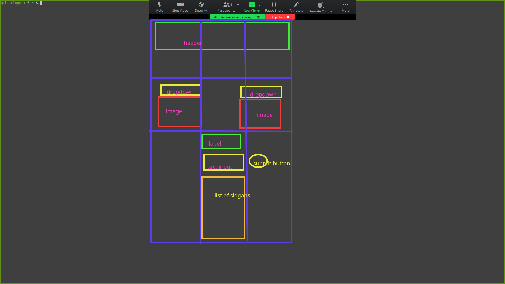

# wireframe

# States
## Start
- header
- two dropdowns with pickers for images
- the images
- input slogan section
- input box
- submit button
- list of slogans

## With user input
- pickable images
- items to be added to the slogan list

# Events
- change images when picked from dropdown
- show slogan when inputted and submit is hit
    - add to an array of slogans
    - clear the DOM for displaying it
    - rewrite all of them
